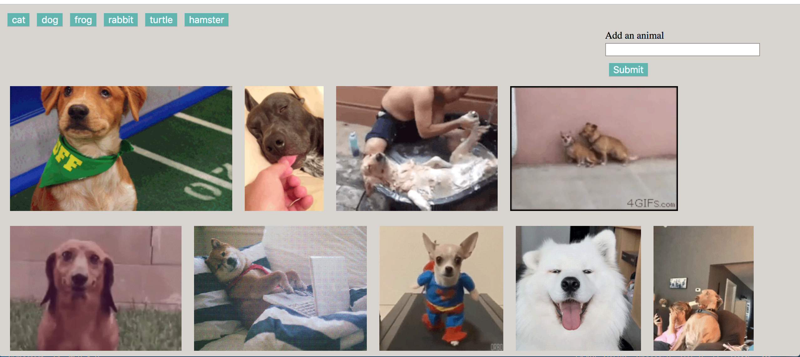

# GifTastic
* When the user clicks on a button, the page grab 10 static, non-animated gif images from the GIPHY API and place them on the page.
* When the user clicks one of the still GIPHY images, the gif animate. If the user clicks the gif again, it stop playing.
* User can add buttons by typing in "Add an animal" and Submit

Please check out the app at https://natalyagar.github.io/GifTastic/

